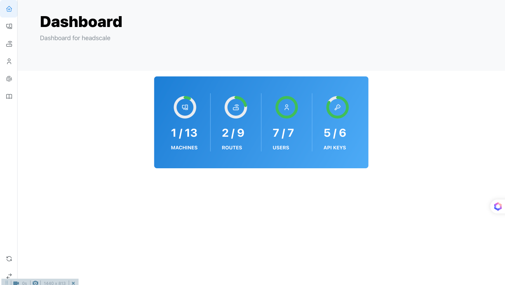

# Headscale-UI

[](https://github.com/Yoshino-s/headscale-ui/actions/workflows/production-release.yml)




## Features

- Light/Dark/Auto theme
- Responsive design
- TypeScript

## Installation

### Docker

```bash
docker run -d -p 8080:80 headscale-ui
```

And goto http://localhost:8080/web/ to see the UI.

### Manual

Download the static assets from https://github.com/Yoshino-s/headscale-ui/releases and serve them with your favorite web server. Example with nginx: [nginx.conf](./nginx.conf)

## Integration with headscale

### Using reverse proxy

You can simply add a route to your reverse proxy to serve the UI. Example with Caddy:

```caddy
headscale.yourdomain.com {
    reverse_proxy headscale:8080
    route /web/* {
        reverse_proxy headscale-ui:80
    }
}
```

### Separate domain

Currently, headscale api cannot be accessed by cors, see https://github.com/juanfont/headscale/issues/623. So you need to set up a reverse proxy to serve the UI and the API. See more detail at the issue.